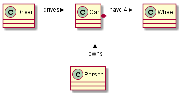

# Monitor do SOMA

	@startuml
	class Car
	 
	Driver - Car : drives >
	Car *- Wheel : have 4 >
	Car -- Person : < owns
	
	@enduml
	
	

Ver documentação sobre [linguagem Swift neste link](https://developer.apple.com/library/ios/documentation/swift/conceptual/Swift_Programming_Language/TheBasics.html#//apple_ref/doc/uid/TP40014097-CH5-XID_454) 