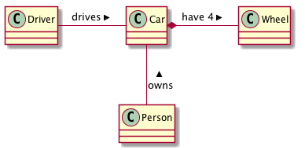

# Monitor do SOMA

	@startuml
	
	class ServiceFacade {
		+ getComposites
		+ getComposite
		+ createOrUpdatePlane
		+ getStateRules
		+ getAnalysisTypes
		+ getValues
	}
	
	enum ACTION  {
		+ GET_COMPOSITES
		+ GET_COMPOSITE
		+ CREATE_OR_UPDATE_PLANE
		+ GET_STATE_RULES
		+ GET_ANALYSIS_TYPES
	}

	class Composite {
	}
	
	class StateRule {
	}
	
	class AnalysisType {
	}
	
	class Value {
	}
	
	@enduml
	
	

Ver documentação sobre [linguagem Swift neste link](https://developer.apple.com/library/ios/documentation/swift/conceptual/Swift_Programming_Language/TheBasics.html#//apple_ref/doc/uid/TP40014097-CH5-XID_454) 